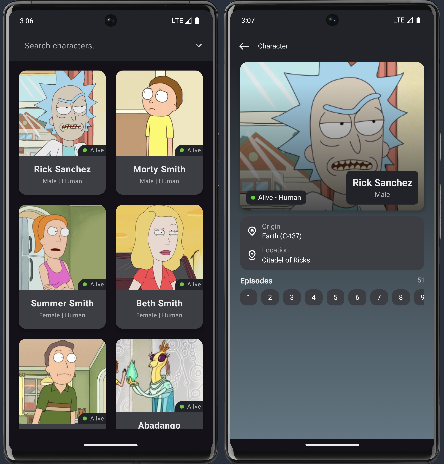

 

<h1 align="center">CharactersRM</h1>

<h3 align="center">This CharactersR&M Android app is a Rick and Morty character browser built with Kotlin 
and Jetpack Compose. It fetches data from the <a href="https://rickandmortyapi.com/">Rick and Morty API</a></h3>

    The main screen supports search and filter functionality. Tapping a character opens a detail screen showing about that character. The app uses a clean architecture and the MVI pattern

## Features

- 🧩 Character Grid: Displays all characters in a 2-column grid with image, name, species, status, and gender. Supports
  pagination.
- 🔍 Search & Filter: Find characters by name or apply filters (status, species, gender).
- 💾 Offline Caching: Previously loaded data is stored in memory.
- 🧠 Detail Screen: Shows full character info. Extracts a dominant color from the image for dynamic theming.

## Screenshots

## Demonstration

https://github.com/user-attachments/assets/68a7a713-34b3-4545-a745-53f5516abc56

